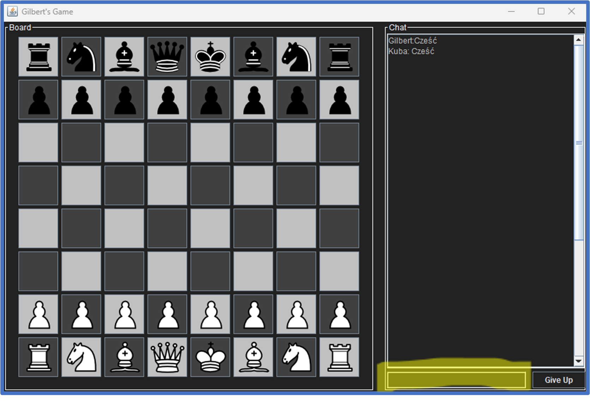
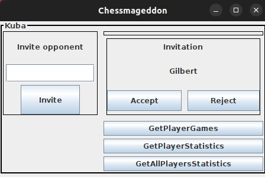

# Chessmageddon
---
**Chessmagedon** to projekt zrobiony przez grupę studentów AGH (Gilbert Guszcza, Jan Gurgul, Jakub Grzyb) w ramach przedmiotu Inżynieria Oprogramowania. 

Jest to aplikacja do gry w szachy poprzez serwer, również znajdujący się w tym projekcie, który obsługuje dodatkowo połączenie z bazą danych przechowującą dane graczy i gier.

Projekt w całości napisany jest w języku Java wykorzystujący, między innymi, bibliotekę Swing do tworzenia aplikacji okienkowej, mySQL do tworzenia bazy danych i jdbc dla mySQL do obsługi bazy danych.

---

## Instalacja aplikacji
 * Zainstalowanie Java w wersji 17 lub nowszej
 * Pobranie pliku [Chess.jar](https://github.com/Isdre/Chessmageddon/blob/master/out/artifacts/Chess_jar/Chess.jar) z folderu repozytorium out/artifacts/Chess_jar
 * Uruchomienie pliku Chess.jar

---

## Instalacja serwera i bazy
* Zainstalować mysql
* Zaimportować ChessServer.sql z folderu database pod adresem: "jdbc:mysql://localhost:3306/ChessServer" z użytkownikiem "root" i bez hasła
* Pobrać plik [Server.jar](https://github.com/Isdre/Chessmageddon/blob/master/out/artifacts/Server_jar/Server.jar) z folderu out/artifacts/Server_jar. (Jeśli się nie udało to oznacza że baza danych jest źle zaimportowana)
* Uruchomić Server.jar
* Następnie można uruchamiać plik Chess.jar

---

## Dokumentacja techniczna i użytownika
Dokumentację umieszczamy w chmurze. Można ją pobrać z tego linku: [Dokumentacja](https://drive.google.com/drive/folders/1jNw_qbgocLBruFItsxFw_-JkBM3K9EvW?usp=sharing)

---

## Licencja
Projekt na licencji BSD 2-Clause "Simplified"
[Zobacz licencję](https://github.com/Isdre/Chessmageddon/blob/master/LICENSE)

---

## Testy
Żeby zobaczyć testy należy pobrać cały projekt przy pomocy git-a.

